[Herviz-Admin](https://github.com/DB-CarRet/Herviz-Admin)  is the background management system of the North American car rental website template [Herviz](https://github.com/DB-CarRet/Herviz), providing business management functions for car rental services and data visualization of business information

[中文](https://github.com/DB-CarRet/Herviz-Admin/blob/master/README.zh.md) | **English**

## Technology Stack

| FrontEnd Framework |          Vue.js           |
| :----------------: | :-----------------------: |
| BackEnd Framework  | Springboot + Mybatis plus |
|    UI Framework    |          D2Admin          |
| Security Framework |         Sa-token          |
| Data Visualization |         E-charts          |
|       Cache        |           Redis           |

##Function Overview

### DashBoard

This page mainly provides data visualization services, which currently include monthly growth statistics of total revenue, total orders, and total users, turnover, order volume, and current inventory of different offices and car brands.

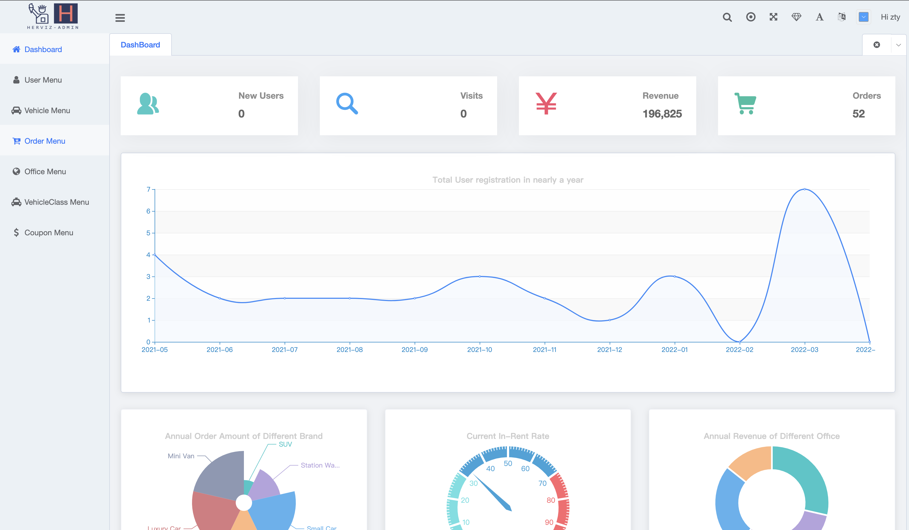

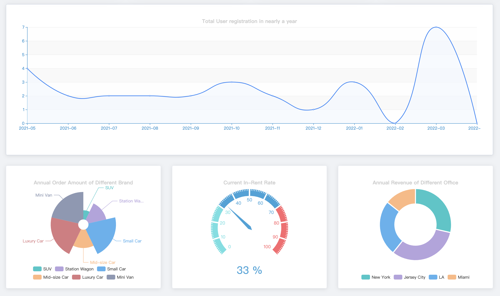

###  Authentication

**Herviz-Admin** uses the open source framework **Sa-token** as the permission framework to provide employee login, registration functions, and user session management functions

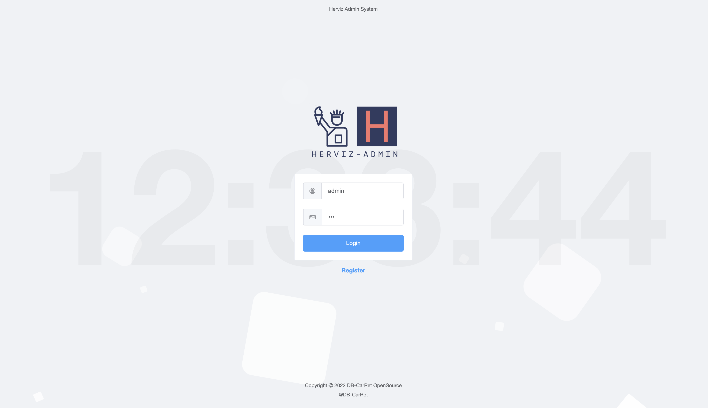

### Vehicle Management

Provide management functions for inventory vehicles, you can add/modify vehicle information and change vehicle storage locations

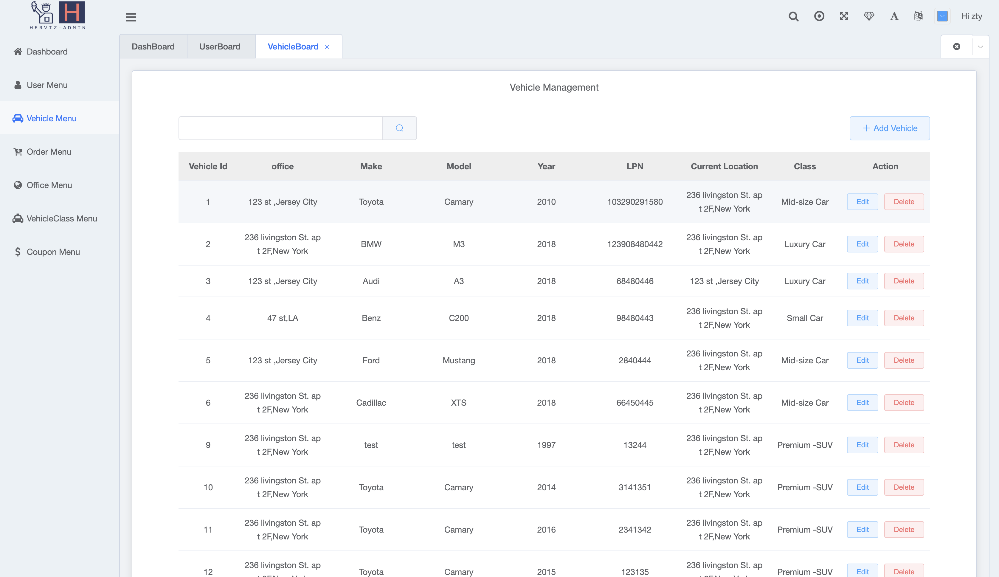

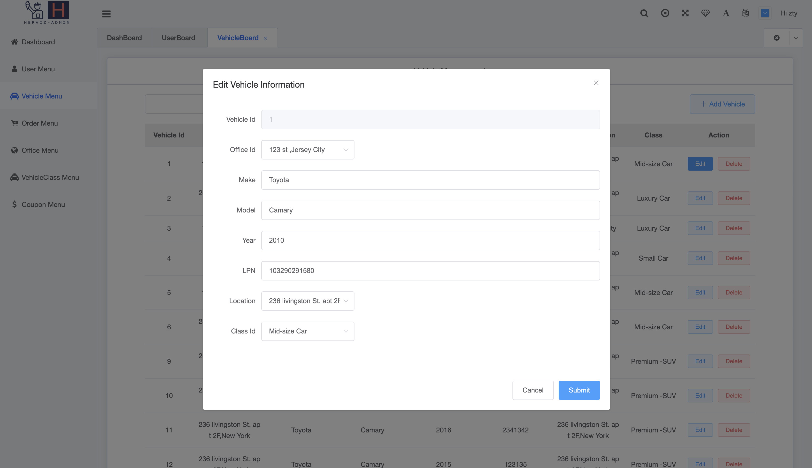

### Order Management

Provide order management functions, including retrieving and viewing user orders, setting mileage fees and other information for orders, modifying orders, etc.

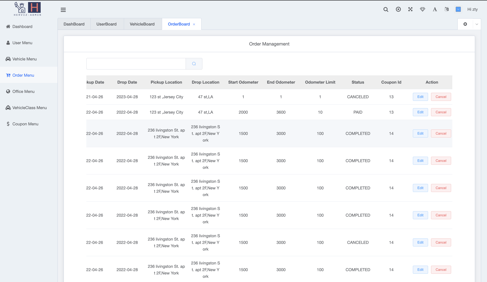

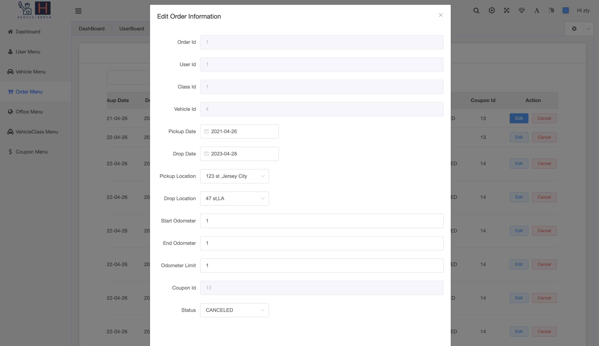

### Office Management

Provide management functions for car rental sites, you can add/modify site information

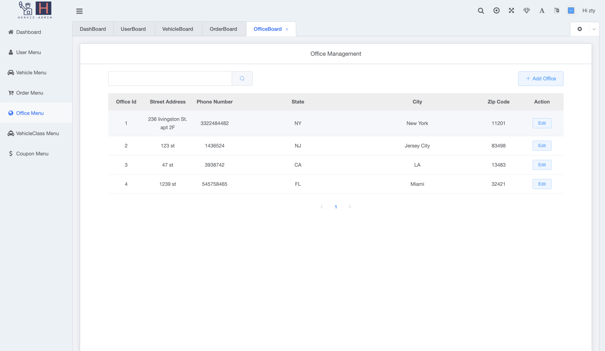

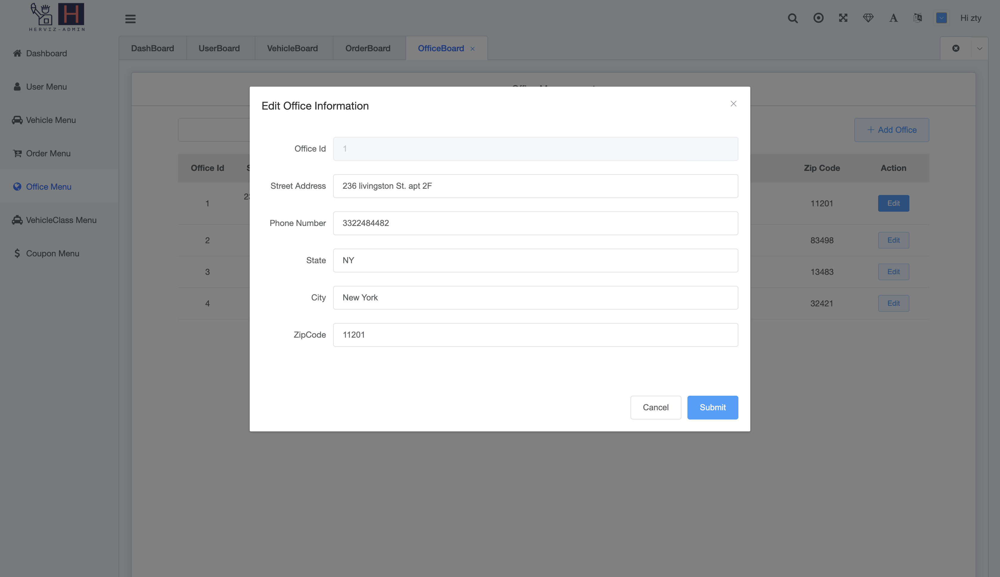

### Vehicle Class Management

Provide vehicle brand management functions, including adding/modifying vehicle brand information

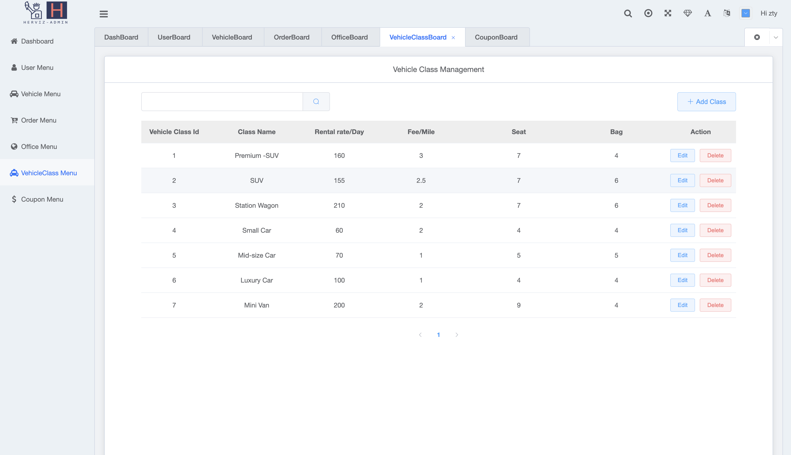

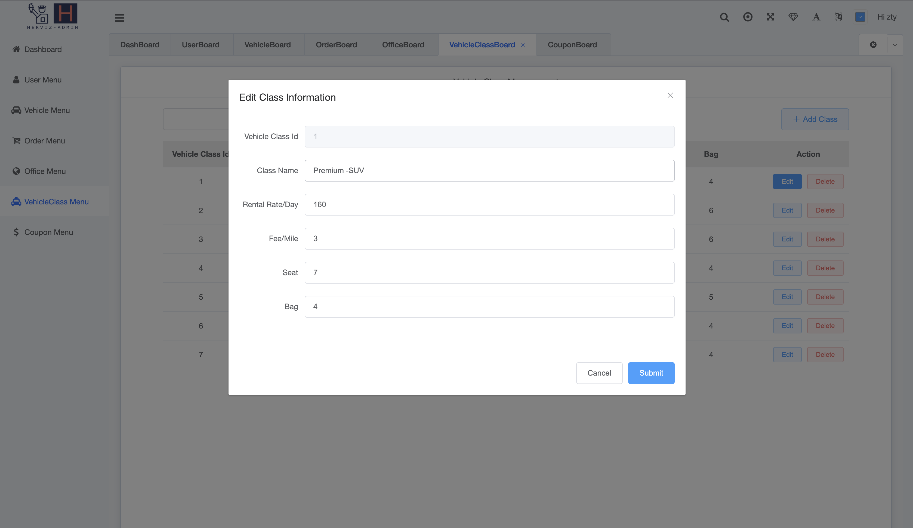

### Coupon Management

Provide coupon management functions, including adding/modifying coupons, entering the effective date of the coupon and discount, and the system will automatically generate a random coupon code

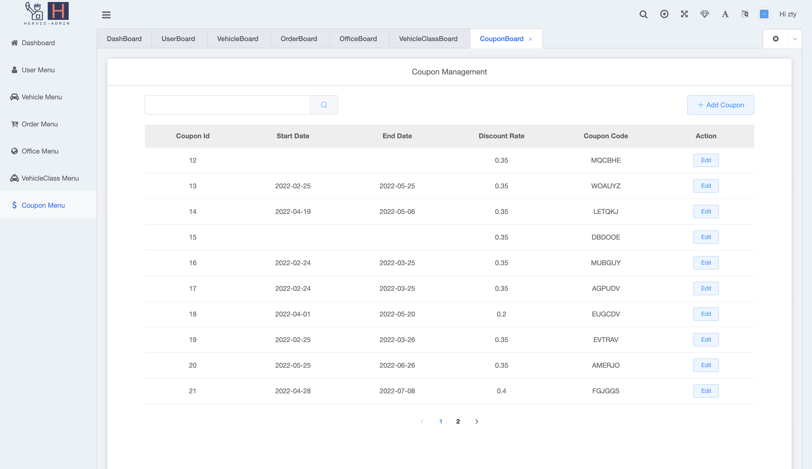

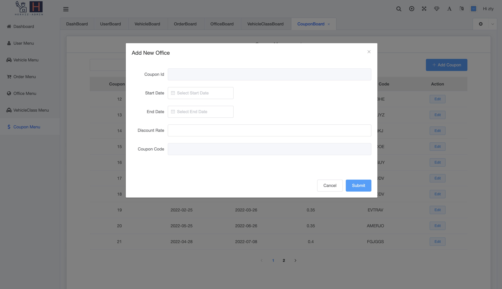

